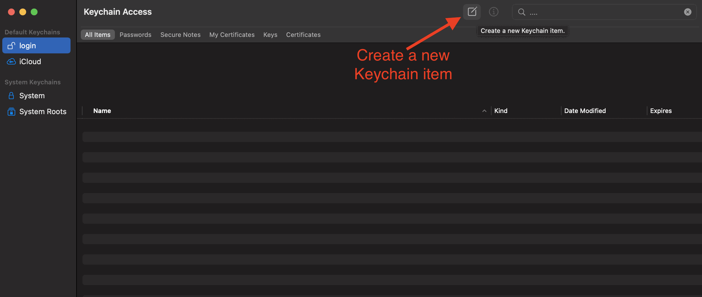

# Enki

A desktop app that provides a GUI for taking notes on github repos/commits. You will need a github personal access token to display your repos. You can download the latest version of the app in the release: https://github.com/ChrisDSaldivar/enki/releases/latest.

- Intel Mac: [download](https://github.com/ChrisDSaldivar/enki/releases/download/v1.0.4/Enki-1.0.4.dmg)
- ARM (M1/M2) Mac: [download](https://github.com/ChrisDSaldivar/enki/releases/download/v1.0.4/Enki-1.0.4.dmg)
- Windows: [download](https://github.com/ChrisDSaldivar/enki/releases/download/v1.0.4/Enki-Setup-1.0.4.exe)

## Generating an Access Token

### Step 0: Log into your GitHub Account

### Step 1: Go to settings


### Step 2: Open your Developer Settings


### Step 3: Generate the Access Token


### Step 4: Configure your token's access


### Step 5: Copy your token

**Once you close this page you'll never be able to see your token again! Make sure you copy it somewhere safe.**


### Step 6: Open Enki

Now open Enki and you'll be prompted for a password and your GitHub access token. You should paste your access token in this field. Enki will use whatever password you give it to encrypt your access token and then store the encrypted token on your local machine. If you forget your password then you'll have to repeat this process and generate a new token.

# Optional Helper Script: MacOS

Copy and run the following command to download the shell script. This script can be used in lieu of running `python3` directly. It will run the python script *and* detect any error codes + log std out and std error. Then it will automatically prompt if you would like to commit your code. This way you can run your code like normal and the script will remind you to commit your code. It is recommended that you use this script since Enki can display the log files that it generates in the UI.

```sh
curl "https://enki-dist.s3.amazonaws.com/py-commit" -s -o /usr/local/bin/py-commit && chmod +x /usr/local/bin/py-commit
```

## Making a repo

If you don't currently use a project folder on your computer then you should start. This will help you organize all of your code. I use a `projects` directory in my home directory. Use these commands to create one:

```sh
# The tilde "~" means "home directory"
# this will create the "projects" directory in your home folder
# you only need to create it once
mkdir ~/projects
```

Now whenever you are working on a project you should `cd` into your project directory first.

```sh
# cd -- means "change directory" 
cd ~/projects
```

### Step 0: Log into GitHub

You'll need to log into GitHub to create a repo.

### Step 1: Create a new repository


### Step 2: Configure your new repo


### Step 3: Copy your repo's URL


### Step 4: Cloning your repo

In your terminal you'll need to run these commands. Make sure you replace `YOUR_REPO_URL` with the url you copied from **step 3** and replace `YOUR_REPO_NAME` with whatever you named your repo in **step 2**.

```sh
# Navigate to your projects directory
cd ~/projects

# Clone the repository
git clone YOUR_REPO_URL

# Launch VS code in your project folder
code YOUR_REPO_NAME
```

### Step 5: 

Now that VS code has launched in your project repository you can open the terminal built into VS code and run these commands. Copy the commands from **your** repo.


## Using private repositories

If you want to use a private repository then you'll need to set up another github access token for keychain access. Otherwise you'll have to log in every time you push/pull from the command line.

### Step 1. Generate a github access token

You'll need a new access token; however, this one is for your personal use rather than for Enki. So you can set the expiration/scopes as you see fit. Honestly, I set this one to never expire and use all scopes. Also I usually name the token after whatever computer I'm using it with for example: `"My MacBook Pro"`. Look back at the previous instructions for generating an access token.

### Step 2. Create a new Mac KeyChain item


### Step 2. Adding your token to your Mac KeyChain
Now follow these steps to create the item.


From this point forward you'll be able to push/pull to private repos without issue. If you set the token to expire then you'll need to generate a new token and update the KeyChain item whenever the old one expires. 

## Using `py-commit`

Now that you have a repo set up and you have `py-commit` installed you can get started. Rather than running code using `python3 myScript.py` instead you will use `py-commit myScript.py` and `py-commit` will handle things from there.

## License

Based on:
MIT © [Electron React Boilerplate](https://github.com/electron-react-boilerplate)
